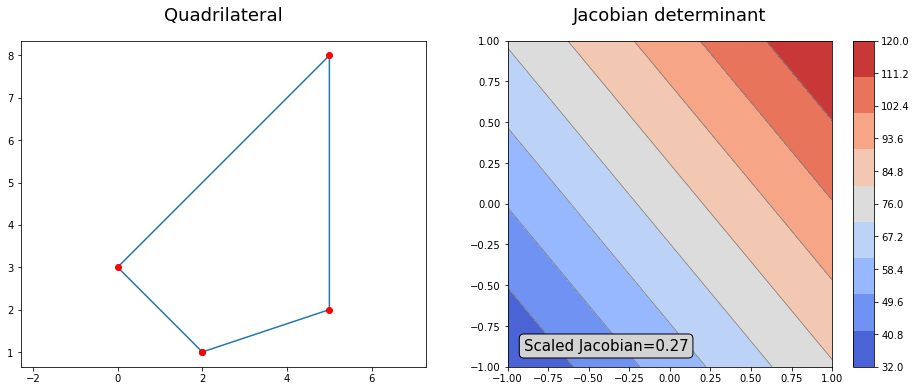

# Scaled Jacobian for a quadrilateral
Scaled Jacobian for iso-parametric mapping from parametric space to physical space for a quadrilateral.

The scaled Jacobian can be used as a metric for the quality of a quadrilateral mesh element. It is defined by the ratio of the minimum and maximum of the Jacobian determinant of the element.

Above images show a quadrilateral (left), its isoparametric mapping Jacobian determinant (right). The scaled Jacobian for the quadrilateral is a scalar value, here .
