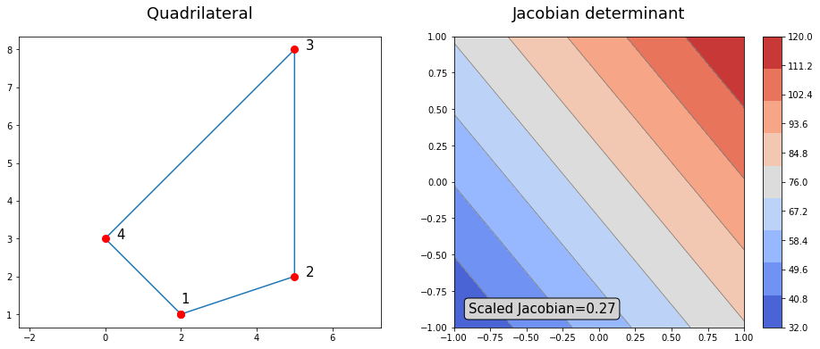

# Scaled Jacobian
Scaled Jacobian for iso-parametric mapping from parametric space to physical space for a quadrilateral.

The scaled Jacobian can be used as a metric for the quality of a quadrilateral mesh element. It is defined by the ratio of the minimum and maximum of the Jacobian determinant of the element.

**A quadrilateral, its isoparametric mapping Jacobian determinant**

The scaled Jacobian for the quadrilateral is a scalar value, here SJ=0.27.
